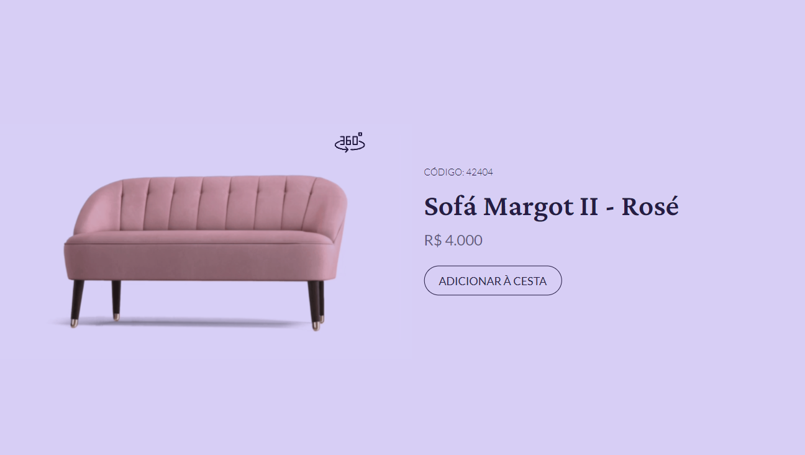

<h1 align="center">Resolução do desafio #boraCodar</h1>

Site criado como resposta ao desafio #boraCodar da Rocketseat

  Desafio 
  &nbsp;&nbsp;&nbsp;|&nbsp;&nbsp;&nbsp;
  Resolução 
  &nbsp;&nbsp;&nbsp;|&nbsp;&nbsp;&nbsp;  
  Preview 

 

## 💻 Desafio

O desafio consiste em desenvolver um card de produto interativo, podendo ser utilizada qualquer tecnologia. A visualização do layout do mesmo é através [desse link](https://www.figma.com/community/file/1195050984449538256), onde há o projeto no figma com o protótipo e os link a serem utilizados.

> É necessário ter conta no [Figma](https://figma.com) para acessá-lo.

 

## 👨‍💻 Resolução

#### Esse projeto foi desenvolvido com as seguintes tecnologias:
  - HTML e CSS
  - JavaScript
  - Git e Github
  - Figma

 

## 🚀 Preview

#### Pré visualização da minha resposta ao desafio:
>  Acesse o site do meu projeto clicando na imagem

 

      

